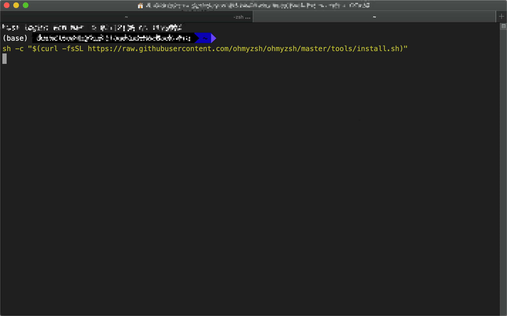
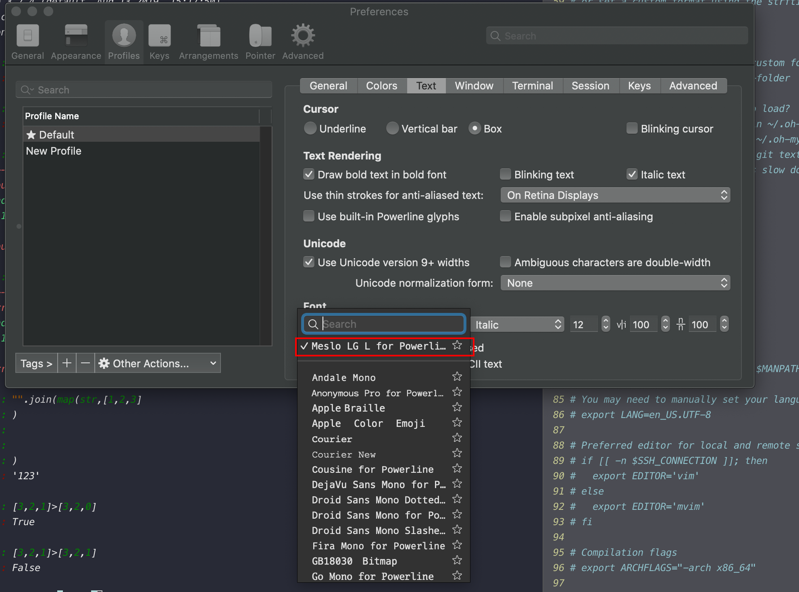
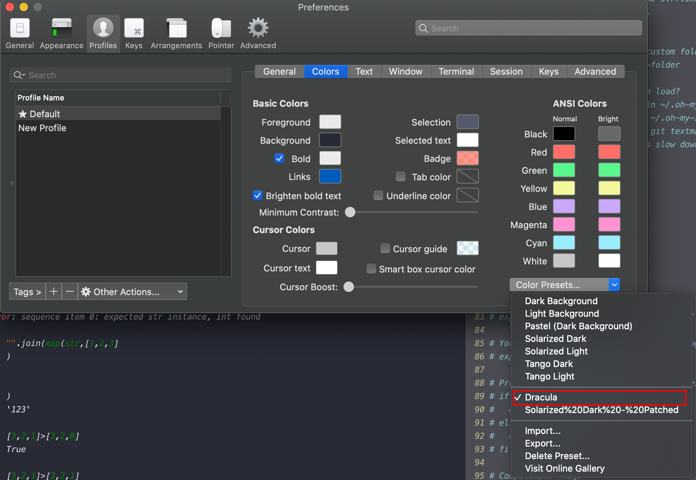

> Good terminal will not make you a 10x developer...but you may feel like one.

## TL;DR

I would show following things in this article:

- How to install iterm2
- How to install oh-my-zsh
- How to set themes for your oh-my-zsh
- How to get the right color theme
- How to configure oh-my-zsh and use some useful plugin and some examples.

## Step 1 install iterm2

https://iterm2.com/

You get what I mean.

## Step 2 install oh-my-zsh

Run the following script in your terminal。

```bash
sh -c "$(curl -fsSL https://raw.githubusercontent.com/ohmyzsh/ohmyzsh/master/tools/install.sh)"
```



## Step 3 set themes for your oh-my-zsh

In this step you need to modify your oh-my-zsh configuration file, which is `.zshrc` under your user root directory.

Edit the `.zshrc` by following command

```bash
vim ~/.zshrc
```

Or if you are not familiar with VIM, use `nano` or anything you normally use to edit a file.

Change the configuration item `ZSH_THEME` at line 11 to:

```bash
ZSH_THEME="agnoster"
```

Since the agnoster is the one I am using currently and really useful one. You could also set it as the one you like.

Agnoster depends on the powerline fonts, you could for the install instruction [there](https://github.com/powerline/fonts).

After you installed the font, change the font setting in preference-profiles-Text-font.



## Step 4 get the right color theme

Get the .itermcolors file from web, mine is [Dracula](https://draculatheme.com/iterm/).

Then change the color setting in preference-profiles-colors-color presets.



## Step 5 Get some useful plugins

You could change the plugin settings in `~/.zshrc`. I am currently using:

```bash
plugins=(
    git
    vi-mode
    zsh-syntax-highlighting
    z
    zsh-autosuggestions
)


```

Some of them are pre-installed, and some of them need to be installed manually, you could find all the plugins and introductions [here](https://github.com/ohmyzsh/ohmyzsh/wiki/Plugins), I would like to introduce some useful plugins for me.

1. vi-mode

   it allows you to edit you command line as in vim, which is extremely helpful when you are dealing some very long command and you need to debug it frequently, as long as you know how to use vim

2. z

   it is preinstalled, so all you need to do to add it is just to type z into `plugins` in your setting file.  It would remember all the path you visited and you could jump the any path you visited by typing part of the directory name.

   