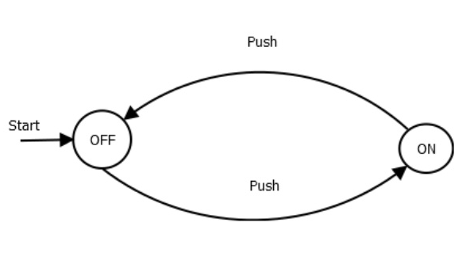

> 自动机：从入门到放弃

## 历史

自动机是一种抽象的计算模型，也可以片面的认为是现代计算机的前身。

1930年，在计算机还没有被发明之前，图灵对自动机做出的贡献是提供了关于自动机计算能力的精准的界限。（即什么自动机能做的，什么是不能做的。）

在1940到1950年之间，有穷自动机成为了研究的主题。同时也在这个阶段，N.chromsky提出了语法这个概念，现在语法已经成为了计算机基础概念的一部分。

1969年，S.Cook在图灵的研究成果之上提出了NP-hard这个概念，明确了能被计算机有效解决的问题和理论上来说是有穷的，但是以现代计算机的计算能力除了其中一小部分问题以外无法解决的问题的界限。

## 有穷自动机

不正式的来说，有穷自动机一个系统，这个系统在任何时候都处于它若干个状态中的一个，并随着外界的输入改变它的状态。

上图是一个开关的有穷自动机模型，从上图我们可以看到，有穷自动机的组件有以下三个

- 状态(state):在模型中，状态用圈表示，指代一个系统的状态。
- 输入(input):在模型中，输入用带箭头的弧表示，指代一个系统的输入。
- 初始状态(start state)：一个有穷自动机总得有一个初始状态，按照常规，这个初始状态被带有start的箭头标志出来。

## 数学推导的入门

​	在书中介绍了几种在自动机理论中常用的推导方法：

### 推导证明(deductive proof)

 在假设的前提之上推导出某些结论。在推导证明下有两个常用的符号和三个常用的手法。
  两种符号
  -  if-then：符号：$\to$
  -  if-and-only-if 符号：$\equiv$
    三种方法
  - 证其逆否命题为真
  - 反证其为真
  - 提出反例
上述都是比较简单的逻辑推理方式和符号，下面只对于本人不大懂的if-then语句讲解一下，不懂的可以自己百度百科_(:з)∠)_
#### if-then

其真值表如下:

| $p$  | $q$  | $p\to q$ |
| :--: | :--: | :------: |
|  T   |  T   |    T     |
|  T   |  F   |    F     |
|  F   |  T   |    T     |
|  F   |  F   |    T     |

对于这个符号，个人的感想是$p\to q$代表的是这个语句的真伪，就比如说：

$p$：今天是晴天

$q$：今天没下雨

那么$p\to q$就是指如果今天是晴天，那么今天没下雨的这个推断。

那么在什么时候这个推断是真的？首先，如果$p$为伪，即今天不是晴天，那么无论今天下雨下雪下冰雹都和这个推断没关系，因为我说的是，如果今天是晴天。

对应的，只有在$p$成立且$q$不成立的的时候这句话是假的，即今天是晴天，且今天下雨了。

当然上述的理解仍然存在漏洞，比如说今天不是晴天，也不能表示$p\to q$这句话是真的，在逻辑学中除了true,false以外还有nonsense这种东西的存在，但是我们就是为了学个自动机理论了解下这个东西，所以不用太深。

### 归纳证明(indective method)
​	即证明n=1时推断成立，然后证明若n=n时条件成立则n=n+1时条件也成立即可，具体内容可自己百度。

## 自动机的初始概念

### 字符集（alphabet）

即有限的，非空的符号集合，通常使用$\sum$定义一个字符集。

### 字符串（string）

即有限的，由一个字符集中的符号组成的排列。 对于一个空的字符串，我们用$\epsilon$来表示

### 字符集幂（power of an alphabet）

  字符集幂是一种特定字符集的字符串的集合。

拿$\sum=\{1,2\}$来举个例子。

定义$\sum^0=\{\epsilon\}$

定义$\sum^1=\{1,2\}$

那么$\sum^2=\{11,12,21,22\}$,$\sum^3=\{111,112,121,122,211,212,221,222\}$

换言之，$\sum^n$是所有长度为n的基于字符集$\sum$的字符串的集合。

在这个基础之上，我们定义

$\sum^*=\sum^0\cup\sum^1\cup\sum^2\cup\sum^3\cup\sum^4\cup...\sum^n$

$\sum^+=\sum^1\cup\sum^2\cup\sum^3\cup\sum^4\cup...\sum^n$

### 语言（language）

基于$\sum$的字符串集合，其为$\sum^*$的子集

